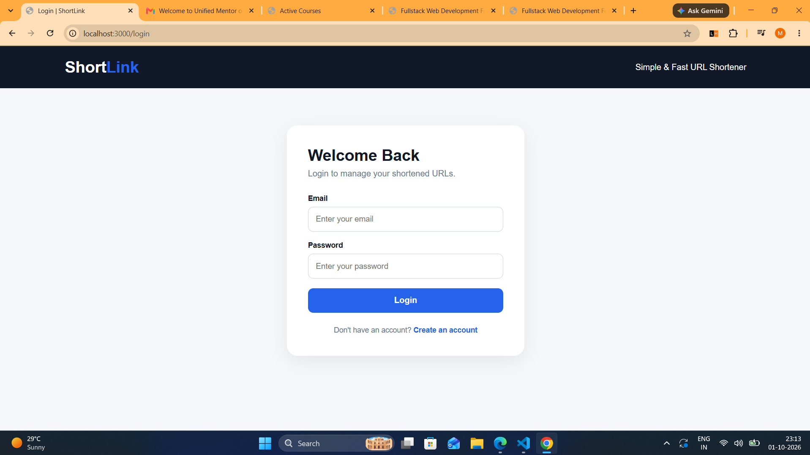
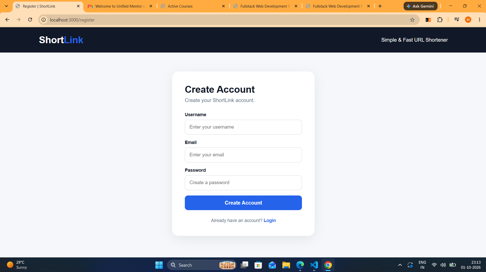
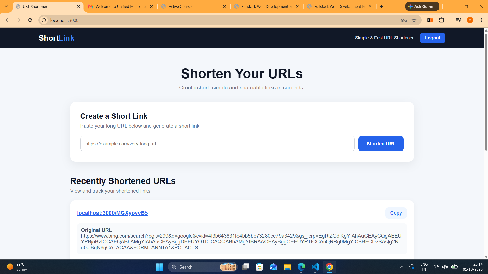

# 🔗 URL Shortener

> A simple and efficient URL Shortener built using **Node.js, Express.js, MongoDB, Mongoose and EJS**, with URL redirection, visit analytics and user authentication.

---

## 🚀 Overview

**URL Shortener** is a web application that converts long URLs into short, easy-to-share links.

The application allows users to:

- 🔗 Create short URLs
- ⚡ Redirect users to the original URL
- 📊 Track total clicks
- 🕒 Maintain visit history
- 🗄️ Store URL data in MongoDB
- 📋 Copy generated short URLs
- 🌐 Access analytics through REST APIs
- 👤 Register a new account
- 🔐 Login securely
- 🚪 Logout from the application
- 🔒 Access protected URL functionality after authentication

---

## ✨ Features

- **URL Shortening** — Generate a unique short URL from any valid long URL.
- **Instant Redirection** — Automatically redirect from the short URL to the original URL.
- **Click Tracking** — Record every visit to a shortened URL.
- **Visit History** — Store visit count and timestamps.
- **MongoDB Integration** — Persist URL and analytics data.
- **REST API** — Backend APIs for URL creation, redirection and analytics.
- **EJS Interface** — Simple and user-friendly web interface.
- **Responsive Design** — Works across different screen sizes.
- **User Registration** — Create a new account using username, email and password.
- **User Login** — Authenticate users using email and password.
- **User Logout** — Logout from the application and clear the authentication cookie.
- **JWT Authentication** — Generate and verify JSON Web Tokens for authenticated users.
- **Password Hashing** — Hash user passwords using bcryptjs before storing them.
- **Authentication Middleware** — Protect URL shortening and analytics routes.
- **HTTP-only Cookie** — Store the JWT authentication token in a cookie.

---

## 🛠️ Technologies Used

| Technology | Purpose |
|------------|---------|
| **Node.js** | Backend runtime |
| **Express.js** | Web framework and REST APIs |
| **MongoDB** | Database |
| **Mongoose** | MongoDB object modeling |
| **EJS** | Dynamic frontend rendering |
| **HTML/CSS** | User interface |
| **JavaScript** | Frontend interactions |
| **ShortID** | Short URL generation |
| **JSON Web Token (JWT)** | User authentication |
| **bcryptjs** | Password hashing |
| **cookie-parser** | Authentication cookie handling |
| **dotenv** | Environment variable management |
| **Nodemon** | Development server |

---

## 📂 Project Structure

```text
URL Shortener/
│
├── controllers/
│   ├── authController.js
│   └── urlController.js
│
├── models/
│   ├── userModel.js
│   └── urlModel.js
│
├── routes/
│   ├── authRoute.js
│   └── urlRoute.js
│
├── Middleware/
│   └── authMiddleWare.js
│
├── views/
│   ├── index.ejs
│   ├── login.ejs
│   └── register.ejs
│
├── ScreenShots/
│   ├── HomePage.png
│   ├── MongoDB_Records.png
│   ├── URL_Details.png
│   ├── Login.png
│   ├── Register.png
│   └── Logout_Functionality.png
│
├── .gitignore
├── index.js
├── package.json
├── package-lock.json
└── README.md

## ⚙️ Application Workflow

```text
User registers an account
        ↓
POST /auth/register
        ↓
Validate user information
        ↓
Hash password using bcryptjs
        ↓
Save user in MongoDB
        ↓
User logs in
        ↓
POST /auth/login
        ↓
Verify email and password
        ↓
Generate JWT token
        ↓
Store JWT token in HTTP-only cookie
        ↓
User accesses URL Shortener
        ↓
Authentication middleware verifies token
        ↓
User enters long URL
        ↓
POST /api/shorten
        ↓
Generate Short ID
        ↓
Save URL in MongoDB
        ↓
Return Short URL
        ↓
User opens Short URL
        ↓
Find URL in MongoDB
        ↓
Record Visit
        ↓
Redirect to Original URL
        ↓
User can view analytics
        ↓
User clicks Logout
        ↓
Authentication cookie is cleared
        ↓
User is redirected to Login
```

---

## 🔌 API Endpoints

| Method | Endpoint                   | Description               |
| ------ | -------------------------- | ------------------------- |
| `GET`  | `/`                        | Display homepage          |
| `GET`  | `/register`                | Display registration page |
| `GET`  | `/login`                   | Display login page        |
| `POST` | `/auth/register`           | Register a new user       |
| `POST` | `/auth/login`              | Login user                |
| `GET`  | `/auth/logout`             | Logout user               |
| `POST` | `/api/shorten`             | Create a short URL        |
| `GET`  | `/api/:shortUrl`           | Redirect to original URL  |
| `GET`  | `/api/analytics/:shortUrl` | Get URL analytics         |

---

## 👤 User Registration

Users can create a new account using their:

* Username
* Email
* Password

### Request

```http
POST /auth/register
```

### Example Body

```json
{
    "username": "Madhur",
    "email": "madhur@example.com",
    "password": "********"
}
```

The password is hashed using **bcryptjs** before being stored in MongoDB.

---

## 🔐 User Login

Registered users can log in using their email and password.

### Request

```http
POST /auth/login
```

### Example Body

```json
{
    "email": "madhur@example.com",
    "password": "********"
}
```

After successful authentication:

```text
User Login
    ↓
Password Verification
    ↓
JWT Token Generated
    ↓
Token Stored in HTTP-only Cookie
    ↓
User Redirected to Homepage
```

---

## 🚪 User Logout

Users can logout using the **Logout** button available on the homepage.

### Request

```http
GET /auth/logout
```

Logout process:

```text
User clicks Logout
        ↓
Authentication cookie cleared
        ↓
User redirected to /login
```

---

## 🔗 Create Short URL

**Request:**

```http
POST /api/shorten
```

**Body:**

```json
{
    "originalUrl": "https://www.example.com"
}
```

**Response:**

```json
{
    "shortUrl": "AaQCQczQp"
}
```

---

## 🔄 URL Redirection

The generated short URL can be accessed using:

```http
GET /api/AaQCQczQp
```

The application:

1. Finds the short URL in MongoDB.
2. Checks whether the URL exists.
3. Records the visit.
4. Stores the visit timestamp.
5. Redirects the user to the original URL.

---

## 📊 Get Analytics

Analytics can be accessed using:

```http
GET /api/analytics/AaQCQczQp
```

Example response:

```json
{
    "totalClicks": 3,
    "analytics": [
        {
            "visitedCount": 1,
            "visitedAt": "2026-09-30T13:07:17.529Z"
        }
    ]
}
```

---

## 🛡️ Authentication Middleware

Protected routes use authentication middleware to verify the user's JWT token.

The middleware:

```text
Request
   ↓
Check authentication cookie
   ↓
JWT token found?
   ↓
Verify JWT
   ↓
Valid token?
   ├── Yes → Allow request
   └── No  → Redirect to Login
```

The authentication middleware protects URL-related functionality from unauthenticated access.

---

## 🗄️ Database

### Database Name

```text
url_shortner
```

---

### User Collection

User information is stored with the following fields:

```text
username
email
password
```

Example:

```json
{
    "username": "Madhur",
    "email": "madhur@example.com",
    "password": "hashed_password"
}
```

---

### URL Collection

URL information is stored with the following fields:

```text
originalUrl
shortUrl
visitedHistory
createdAt
updatedAt
```

Example:

```json
{
    "originalUrl": "https://www.google.com",
    "shortUrl": "AaQCQczQp",
    "visitedHistory": [
        {
            "visitedCount": 1,
            "visitedAt": "2026-09-30T13:07:17.529Z"
        }
    ]
}
```

---

# 📸 Screenshots

## 🏠 Home Page

**Image Path:**

```text
ScreenShots/HomePage.png
```


---

## 🔐 Login Page

**Image Path:**

```text
ScreenShots/Login.png
```



---

## 📝 Register Page

**Image Path:**

```text
ScreenShots/Register.png
```



---

## 🚪 Logout Functionality

**Image Path:**

```text
ScreenShots/Logout_Functionality.png
```



---

## 🗄️ MongoDB Records

**Image Path:**

```text
ScreenShots/MongoDB_Records.png
```


---

## 📊 URL Details & Analytics

**Image Path:**

```text
ScreenShots/URL_Details.png
```


---

## 💻 Installation & Setup

### 1. Clone the Repository

```bash
git clone https://github.com/madhurkamble/URL-Shortener.git
```

### 2. Open the Project

```bash
cd URL-Shortener
```

### 3. Install Dependencies

```bash
npm install
```

### 4. Start MongoDB

Make sure MongoDB is running locally.

The application uses:

```text
mongodb://localhost:27017/url_shortner
```

### 5. Configure Environment Variables

Create a `.env` file in the project root:

```env
JWT_SECRET=my_super_secret_key_123456
```

> Make sure `.env` is included in `.gitignore`.

### 6. Start the Server

```bash
node index.js
```

Or, if Nodemon is configured:

```bash
npm run dev
```

### 7. Open the Application

```text
http://localhost:3000
```

---

## 🔐 Environment Configuration

The application uses environment variables for JWT authentication.

Example `.env`:

```env
JWT_SECRET=my_super_secret_key_123456
```

> Do not upload the `.env` file to GitHub.

---

## 🔮 Future Enhancements

* 👤 Personal URL dashboard
* 🎯 Custom short URLs
* 📊 Graph-based analytics
* 📱 QR code generation
* ⏳ URL expiration
* 🌍 MongoDB Atlas integration
* ☁️ Cloud deployment
* 🔒 Rate limiting and API security
* 📈 Advanced click analytics

---

## 🎯 Learning Outcomes

Through this project, I practiced:

* Building REST APIs with Express.js
* Working with MongoDB and Mongoose
* Designing Mongoose schemas
* Implementing MVC-style project structure
* Handling HTTP requests and responses
* Implementing URL redirection
* Connecting frontend and backend using JavaScript
* Server-side rendering with EJS
* Tracking and storing analytics data
* Implementing user registration and login
* Using JWT for authentication
* Hashing passwords using bcryptjs
* Managing authentication using HTTP-only cookies
* Protecting routes using authentication middleware
* Managing environment variables using dotenv
* Using Git and GitHub for version control

---

## 👨‍💻 Author

### Madhur Kamble

🔗 **GitHub:**

[https://github.com/madhurkamble](https://github.com/madhurkamble)

🔗 **LinkedIn:**

[https://www.linkedin.com/in/madhur-kamble-55911b290](https://www.linkedin.com/in/madhur-kamble-55911b290)

---

## ⭐ Support

If you found this project useful, consider giving the repository a **⭐ Star** on GitHub.

```
```

